# Performance Profiling

Before optimization:
#### Commit Duration(filtering, searching, sorting): (from Timeline)4.8, 5.7, 2.8
#### Render Duration(filtering, searching, sorting):
- `<Home />` – 1.2ms, 3.6ms, 1.1ms
- `<CountryList />` – 2.1ms, 5ms, 1.7ms 
- `<Search />` – 0.2ms, 1.7ms, 0.6ms
Total - 4.3ms, 12.6ms, 3.4ms

### Interactions: User interactions that triggered the renders.
- Searching: Typing in the search bar (`<Search />`) → triggered `<Home />`, `<Search />` and `<CountryList />` re-renders.
- Filtering: Selecting a region in the dropdown (`<select>`) → triggered `<Home />`, `<Search />` and `<CountryList />` re-renders.
- Sorting: Clicking on the "Sort by Name" or "Sort by Population" button → triggered `<Home />`, `<Search />`  and `<CountryList />` re-renders.

### Flame Graph(filtering, searching, sorting):
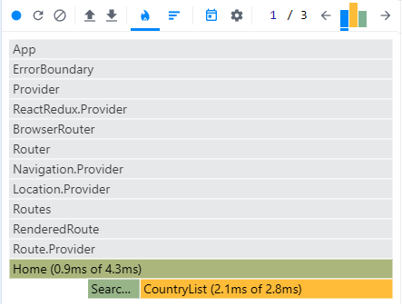
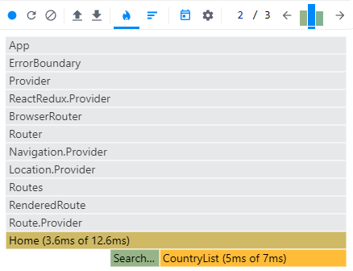
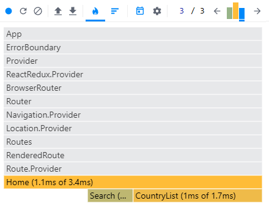

### Ranked Chart(filtering, searching, sorting):
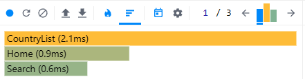
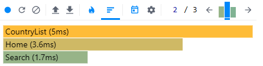
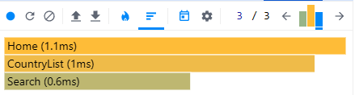

---------------------------------------------------
# After optimization:
#### Commit Duration(filtering, searching, sorting): (from Timeline) 10.4ms, 4.1ms, 3.7ms
#### Render Duration(filtering, searching, sorting):
- `<Home />` – 1.4ms, 2ms, 1ms
- `<CountryList />` – 2.2, 2.7ms, 1.1ms
- `<Search />` – 0.5ms, 1.1ms, 0.6ms
Total - 5.3ms, 7.5ms, 3.6ms

### Interactions: User interactions that triggered the renders.
- Searching: Typing in the search bar (`<Search />`) → triggered `<Home />`, `<Search />` and `<CountryList />` re-renders.
- Filtering: Selecting a region in the dropdown (`<select>`) → triggered `<Home />`, `<Search />` and `<CountryList />` re-renders.
- Sorting: Clicking on the "Sort by Name" or "Sort by Population" button → triggered `<Home />`, `<Search />`  and `<CountryList />` re-renders.

### Flame Graph(filtering, searching, sorting):
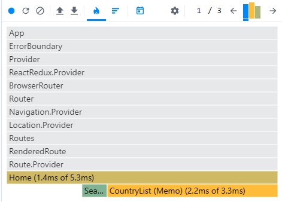
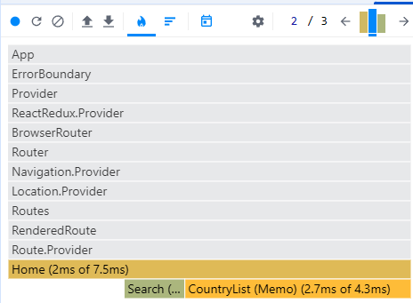
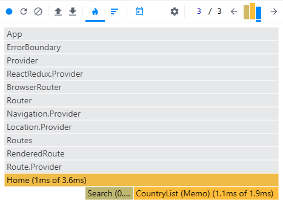

### Ranked Chart(filtering, searching, sorting):
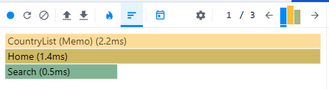
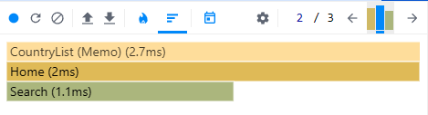
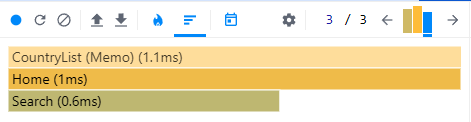

---------------------------------------------------
# After optimization (one more time):
#### Commit Duration(filtering, searching, sorting): (from Timeline) 11.2ms, 3.1ms, 4.4ms
#### Render Duration(filtering, searching, sorting):
- `<Home />` – 1ms, 1.7ms, 1.1ms
- `<CountryList />` – 2ms, 1.9ms, 1.2ms
- `<Search />` – 0.7ms, 1.1ms, 0.5ms
Total – 4.5ms, 6.2ms, 3.6ms

### Interactions: User interactions that triggered the renders.
- Searching: Typing in the search bar (`<Search />`) → triggered `<Home />`, `<Search />` and `<CountryList />` re-renders.
- Filtering: Selecting a region in the dropdown (`<select>`) → triggered `<Home />`, `<Search />` and `<CountryList />` re-renders.
- Sorting: Clicking on the "Sort by Name" or "Sort by Population" button → triggered `<Home />`, `<Search />`  and `<CountryList />` re-renders.

### Flame Graph(filtering, searching, sorting):
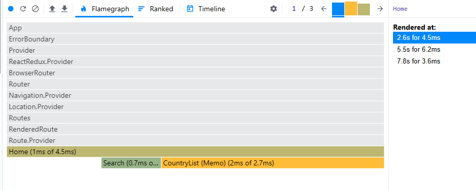
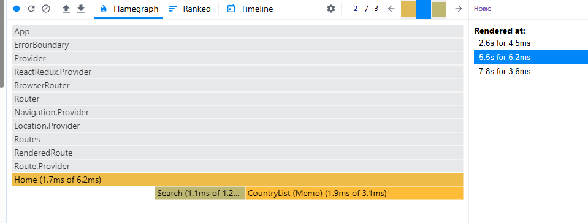
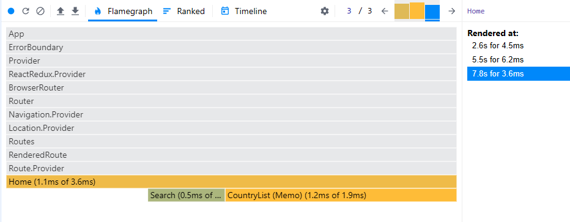

### Ranked Chart(filtering, searching, sorting):
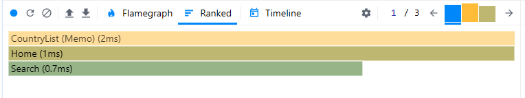
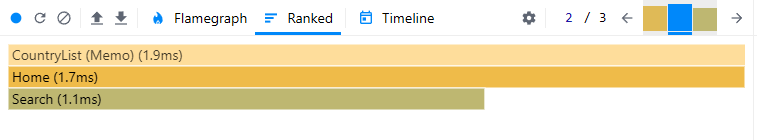
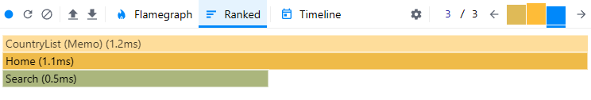

---------------------------------------------------
# After optimization (one more time):
#### Commit Duration(filtering, searching, sorting): (from Timeline) 9.1ms, 3.9ms, 3.4ms
#### Render Duration(filtering, searching, sorting):
- `<Home />` – 0,6ms, 1.8ms, 0.9ms
- `<CountryList />` – 0,6 ms, 1ms, 0.4ms
- `<Search />` – 0.6ms, 1ms, 0.4ms
Total – 1.7ms, 4.1ms, 1.8ms

### Interactions: User interactions that triggered the renders.
- Searching: Typing in the search bar (`<Search />`) → triggered `<Home />`, `<Search />`, `<CountryList />` and `<CountryСard />` re-renders.
- Filtering: Selecting a region in the dropdown (`<select>`) → triggered `<Home />`, `<Search />`, `<CountryList />` and `<CountryСard />` re-renders.
- Sorting: Clicking on the "Sort by Name" or "Sort by Population" button → triggered `<Home />`, `<Search />`, `<CountryList />` and `<CountryСard />` re-renders.

### Flame Graph(filtering, searching, sorting):
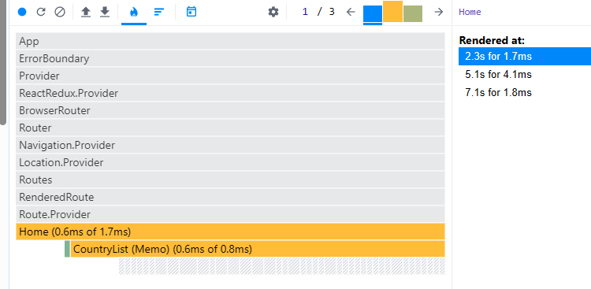
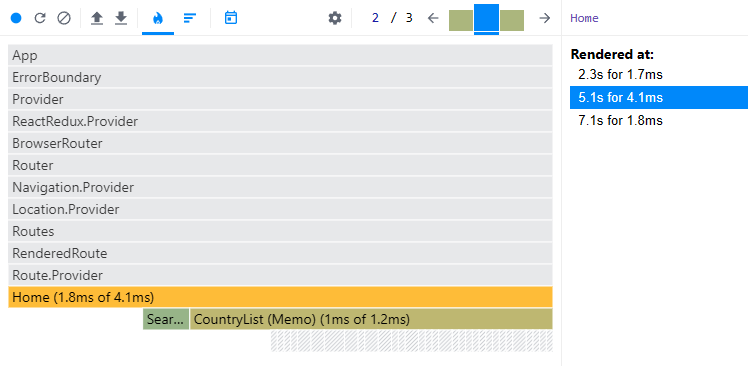
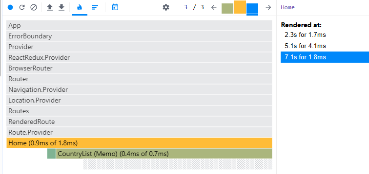

### Ranked Chart(filtering, searching, sorting):
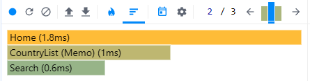
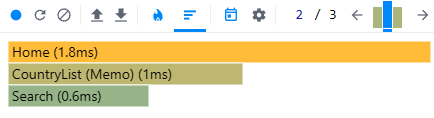
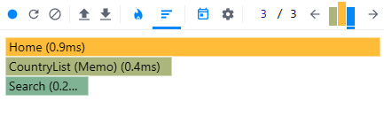
